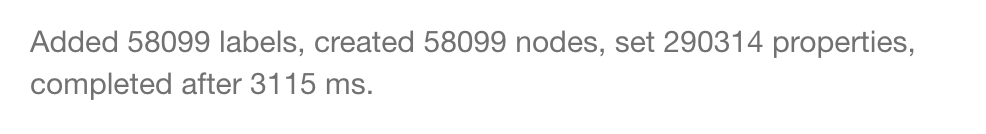
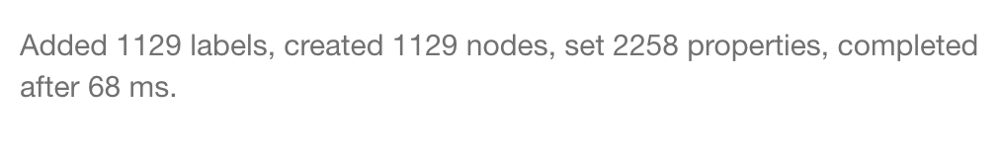
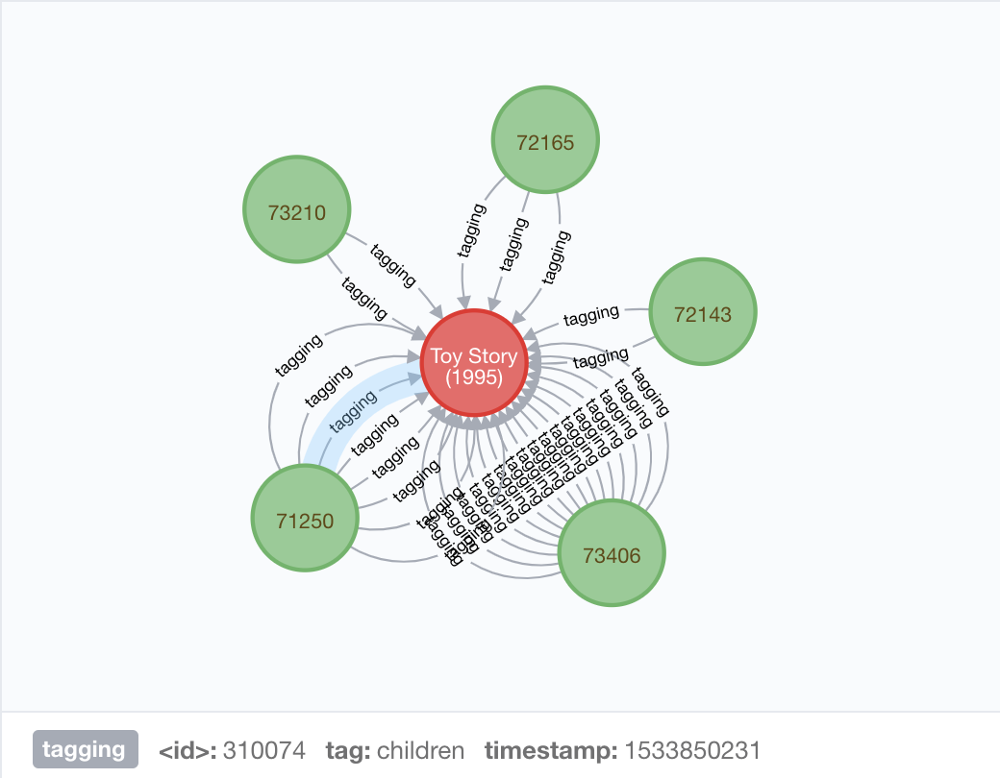

# neo4j实现任务：找到【某个风格最受欢迎的20部电影】

## 实验目的

* 充分理解和体现neo4j图数据库的特点，将类似于关系型数据库存储方式的csv文件转为【图】的方式存储。使用neo4j进行查询就不需要自己写遍历图的算法，查询语句可以得到简化；想增添数据或者改变关系也具有很大灵活性；性能很棒，查询速度很快。

## 实验过程

* 创建movie节点（或者称之为：有movie标签的节点）

```
USING PERIODIC COMMIT 10000
LOAD CSV FROM "file:///movies.csv" AS line
CREATE(n:movie{movieId:line[0],title:line[1],genres:line[2],imdbId:line[3],tmdbId:line[4]})
```



* 创建genome_tag节点

```
USING PERIODIC COMMIT 10000
LOAD CSV FROM "file:///genome-tags.csv" AS line
CREATE (n:genome_tag{tagId:line[0],tag:line[1]})
```



* 如上，可以看到导入速度还可以。

```
// 写法1
// 一步到位
USING PERIODIC COMMIT 10000
LOAD CSV FROM "file:///tags.csv" AS line
MATCH (movie:movie{movieId:line[1]})
CREATE (n:user{userId:line[0]})-[r:tagging{tag:line[2],timestamp:line[3]}]->(movie)

// 写法2
// 先建立user节点
USING PERIODIC COMMIT 10000
LOAD CSV FROM "file:///tags.csv" AS line
MERGE (n:user{userId:line[0]})
	// 注意，CREATE CONSTRAINT ON 该语句只是限制不能创建相同的，若相同会报错而已；应使用MERGE=MATCH+CREATE
	
// 再创建user和movie的关系（user给movie打标签）
USING PERIODIC COMMIT 10000
LOAD CSV FROM "file:///tags.csv" AS line
MATCH (movie:movie{movieId:line[1]})
MATCH (user:user{userId:line[0]})
MERGE (user)-[r:tagging{tag:line[2],timestamp:line[3]}]->(movie)

```

* tags中，同一个用户对同一个电影打的各个标签是分开的，比如剧情、恐怖这两个算两条，时间戳也不一样。如果在自己的笔记本上想加快速度，并且不会用到tagging的属性，可以建立无属性的关系tagging，否则导入数据的速度有点儿慢。结果如下：



* 同理，建立user对movie的rating关系。

* 【某个风格最受欢迎的20部电影】观察现实情况，吃瓜群众边吐槽边看得很热闹的电影不在少数，或者考虑到“观众的眼睛是雪亮的”，个人对此题就简单粗暴地理解为【指定类别，找到改看得人最多的20部电影】。从图的语言来描述，就是从某个tag节点出发，找到与之相连的movie节点中，有最多的user打过标签（tagging）或者打过分（rating）的那个。

* 精简的代码如下：

```
MATCH (t:genome_tag{tag:"children"})--(m:movie)<--(u:user)
WITH m, collect(DISTINCT u.userId) AS id,count(DISTINCT u) AS cnt
ORDER BY cnt DESC LIMIT 20
RETURN m,cnt,id 
```

* 简单解释，DISTINCT可以让count计数时不计入重复值。WITH可以连接多个查询，ORDEY BY语句进行排序，DESC指定是降序排序，LIMIT指定个数，collect以列表形式返回结果。

### 参考
1. [Neo4j Cypher 复杂查询详解之WITH](https://blog.csdn.net/heyuanhao1989/article/details/50055789)
2. [Neo4j Cypher 手册](https://neo4j.com/docs/cypher-manual/3.5/)